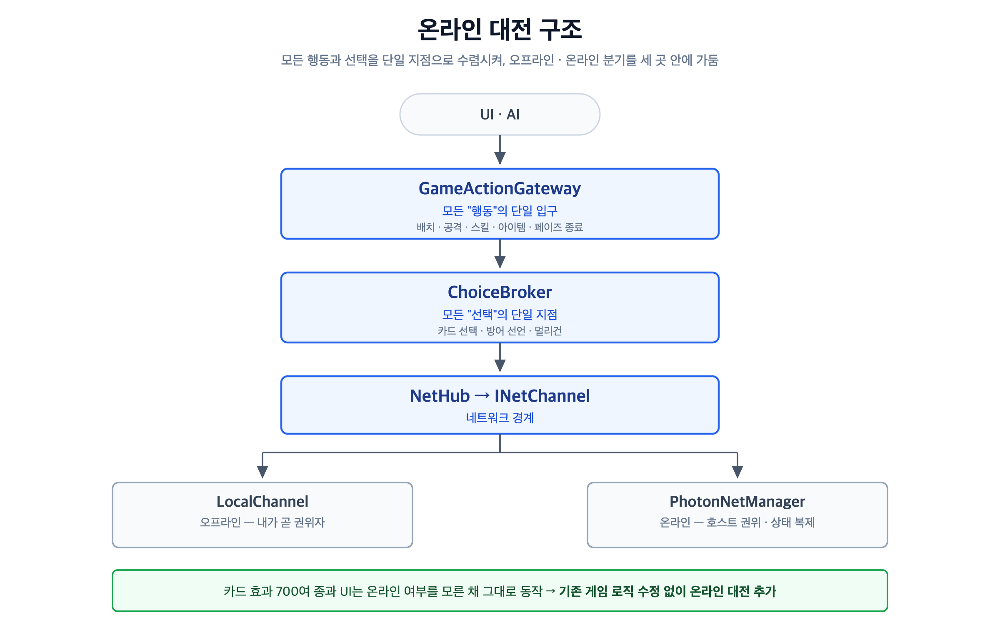

# 니벨아레나 (NivelArena)

TCG *니벨아레나*의 룰을 Unity로 구현한 **1인 개인 프로젝트**입니다.
카드 800여 종의 효과 처리, 온라인 대전, 계정 기반 클라우드 덱 저장까지 구현했습니다.

| | |
|---|---|
| **기간** | 2026.05 ~ 2026.08 |
| **인원** | 1인 (설계 · 프로그래밍 · 데이터 구축) |
| **엔진 / 언어** | Unity 6000.3 / C# |
| **주요 기술** | Photon PUN2, Unity Gaming Services (Authentication · Cloud Save) |
| **플랫폼** | Windows · macOS 스탠드얼론 |
| **규모** | 스크립트 79개 · 약 22,700줄 / 카드 804종 · 리더 37종 (24개 세트) |

<!-- ▶ 플레이 영상: (유튜브 링크) -->
<!-- 스크린샷: 대전 화면 / 덱빌더 / 온라인 대전 / 로그인 -->

---

## ⚠️ 이 저장소에 대하여

실존 TCG의 룰을 **개인 학습 목적으로** 구현한 프로젝트입니다.
카드 이미지와 카드 데이터는 원저작자의 자산이므로 **이 저장소에 포함하지 않았습니다.**

따라서 이 저장소는 **직접 작성한 C# 코드와 설계 문서만** 담고 있으며,
**그대로 빌드·실행되지 않습니다.** 구조와 구현을 보여드리기 위한 저장소입니다.

```
포함  ✅  Scripts/ (직접 작성한 코드 전체) · 설계 문서
제외  ❌  카드 이미지 875장 · 카드 데이터 804종 · 카드 DB(JSON)
```

---

## 무엇을 만들었나

**게임플레이** — 턴 진행(레벨업 → 드로우 → 메인 → 어택 → 엔드), 필드 배치·업그레이드,
전투 해결(조우 · 다이렉트 · 방어 선언 · 가디언 · 돌파 · 공멸), 대미지 존과 트리거,
리더 각성 · 리더 액티브 · 패시브.

**카드 효과 700여 종** — 효과 텍스트를 파싱하지 않고 `"타입:값"` 형식의 문자열로 관리하고,
핸들러 레지스트리로 디스패치합니다.

**덱빌더** — 드래그 앤 드롭 편집, 커스텀 덱 저장. 덱 합법성 검증(40장 / 동일 카드 3장 /
트리거 8장 / 속성 서약)은 온라인에서 **호스트가 상대 덱까지 검증**해 변조된 덱을 차단합니다.

**온라인 대전** — 방 코드 매칭, 호스트 권위 방식, 상태 스냅샷 복제.
상대 손패는 장수만 전송해 히든 정보를 유지합니다.

**계정 · 클라우드 덱 저장** — 아이디/비밀번호 로그인(선택). 로그인하면 덱이 계정에 저장돼
다른 PC에서도 사용할 수 있고, 로그인하지 않아도 기존과 동일하게 플레이할 수 있습니다.

**AI 대전 상대** — 배치 · 업그레이드 · 아이템 장착 · 공격/방어 판단 · 스킬 · 액티브 사용.

---

## 설계에서 가장 신경 쓴 것

### 싱글 플레이로 완성한 게임에 온라인 대전 추가하기

싱글 플레이로 게임을 완성한 뒤 온라인을 붙이려 하니, 카드 효과 700여 종이 모두
*"지금 이 게임은 내가 혼자 돌린다"* 는 전제로 작성되어 있었습니다.
효과마다 네트워크 분기를 넣는 방식은 유지가 불가능하다고 판단했습니다.

게임에서 일어나는 일을 **'행동'과 '선택'** 두 가지로 나누고, 각각 단일 진입점을 만들었습니다.



결과적으로 오프라인·온라인 분기는 **이 세 지점 안쪽에만** 존재합니다.
카드 효과 코드와 UI는 온라인 여부를 모른 채 그대로 동작하고,
**온라인 대전을 추가하면서 기존 게임 로직은 수정하지 않았습니다.**

같은 구조를 나중에 계정·저장 기능에도 재사용했습니다. 저장 백엔드를 `IDeckStore`로 분리해 두고
**로컬 → 계정별 → 클라우드**로 두 번 교체했는데, `DeckSaveLoad`를 호출하는 12곳은
한 줄도 바뀌지 않았습니다.

### 효과 700여 종을 거대 switch 없이

카드는 효과를 문자열 리스트로 가집니다 — `"AttackerPowerBoost:1000"`, `"Chain:C:3"` 처럼
`"타입:값"` 형식입니다. 엔진은 이 타입을 **Dictionary로 디스패치**합니다.

```
card.EffectTypes 순회 → _entryHandlers[type] 호출
                        (Entry / Attacker / Exit / Trigger / Skill 별 레지스트리)
```

새 카드를 추가할 때 **핸들러 메서드 1개를 작성하고 1줄로 등록**하면 되고,
엔진(`OnUnitPlaced` 등)은 건드리지 않습니다.
세트별로 파일을 분리해(`EffectSystem.BT07.cs` 등) 한 세트를 작업하다 다른 세트를 건드리는 일도 막았습니다.

---

## 코드 읽는 순서

22,000줄을 처음부터 볼 필요는 없습니다. 이 순서가 가장 빠릅니다.

| | 무엇을 | 어디를 |
|---|---|---|
| 1 | 데이터가 무엇인가 | `Scripts/Data/CardData.cs` · `Scripts/Managers/PlayerController.cs` |
| 2 | 게임이 어떻게 흘러가나 | `Scripts/Managers/TurnManager.cs` → `GameManager.cs` |
| 3 | 보드와 전투 | `FieldManager.cs` → `CombatManager.cs` |
| 4 | **효과 엔진 (핵심)** | `EffectSystem.cs` → `EffectSystem.EntryHandlers.cs` → `EffectActions.cs` |
| 5 | 입력이 모이는 곳 | `GameActionGateway.cs` → `ChoiceBroker.cs` |
| 6 | 온라인 | `INetChannel.cs` / `NetHub.cs` → `PhotonNetManager.cs` |
| 7 | 계정 · 저장 | `Data/DeckStore.cs` → `Data/AuthManager.cs` → `Data/UgsDeckStore.cs` |

> 각 `EffectSystem.*Handlers.cs`의 핸들러 주석에 **카드번호와 효과 요약이 병기**돼 있어,
> 어떤 카드가 어떤 코드로 구현됐는지 바로 대조할 수 있습니다.

---

## 문서

- **[ARCHITECTURE.md](ARCHITECTURE.md)** — 시스템 구조와 설계 근거 (제일 먼저 읽기 좋습니다)
- **[docs/blog/](docs/blog/)** — 설계 결정을 주제별로 풀어 쓴 글

| 글 | 내용 |
|---|---|
| 단일 관문 — GameActionGateway | 모든 행동을 한 곳으로 모은 이유 |
| 코루틴 — 턴제 게임의 흐름 | 턴 루프를 코루틴으로 짠 이유 |
| 상태 복제 — 무엇을 보내지 않을 것인가 | 히든 정보와 스냅샷 설계 |
| 문답 — RaiseEvent | Photon 이벤트를 다루며 정리한 것 |
| 이벤트 기반 UI — 누가 듣는지 모른다 | UI를 이벤트로 갱신한 이유 |
| AI — 규칙 442줄로 상대를 만들기 | 휴리스틱 AI의 구성과 한계 |
